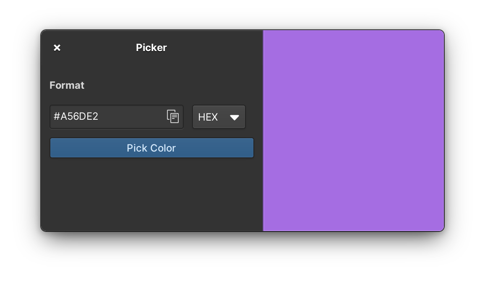
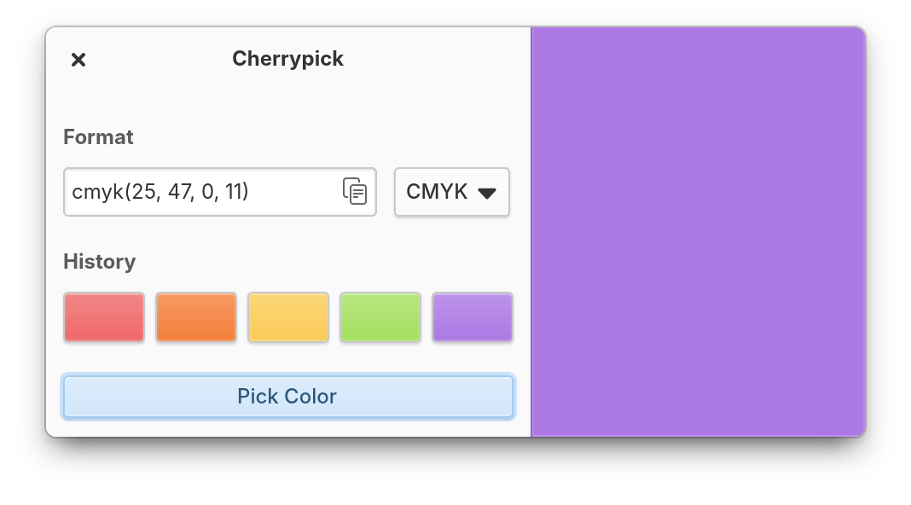
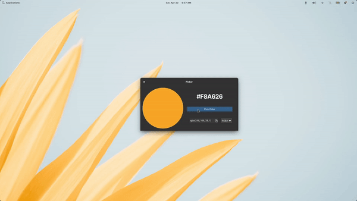

<div align="center">
  <div align="center">
    
  </div>
  <h1 align="center">Cherrypick</h1>
  <p align="center">
    A simple color picker for elementary OS
  </p>
  <a href="https://appcenter.elementary.io/io.github.ellie_commons.cherrypick">
    
  </a>
</div>

## Screenshots
|  |  |
|----------------------------------------------------------------------------|------------------------------------------------------------------------------|

## Demo


## Installation

### On elementary OS
On elementary OS you can get Cherrypick from the app center.

### On other distros
Cherrypick has been designed for and tested on elementary OS. However you can always
install Cherrypick as a flatpak on any distro with flatpak support from the elementary flatpak repository
```
flatpak install https://flatpak.elementary.io/repo/appstream/io.github.ellie_commons.cherrypick.flatpakref
```
Flatpak is the recommended method of installation, however if you don't want
to use flatpak you can always build from source using the build instructions.

## Usage
If installed as flatpak the program can be launched using
```
flatpak run io.github.ellie_commons.cherrypick
```
the app can be launched directly in color picking mode using the command line
option `--pick-color`. This could be perhaps be used to set up a keybinding.
```
flatpak run io.github.ellie_commons.cherrypick --pick-color
```
and the program should also be visible in your launcher/application menu

## Building and running
Download or clone the repo
```
git clone https://github.com/ellie-commons/cherrypick.git
cd cherrypick
```
### Build with Flatpak

Run `flatpak-builder` to build and install as flatpak for the current user
```
flatpak-builder build io.github.ellie_commons.cherrypick.yml --user --install --force-clean
```
the program should now be installed and can be run using
```
flatpak run com.github.phoneybadger.trimmer
```

### Without flatpak

You'll need the following dependencies
- `valac`
- `meson`
- `libgtk-3-dev`
- `libgranite-dev`
- `libhandy-1-dev`

run `meson` to set up the build environment and then use `ninja` to build
```
meson build --prefix=/usr
ninja -C build
```
to install use `ninja install`, execute with `io.github.ellie_commons.cherrypick`
```
ninja install
io.github.ellie_commons.cherrypick
```

## Support Me
[](https://ko-fi.com/X8X7D99T6)

## Credits
- Directly inspired by and uses some code from the now unmaintained [ColorPicker](https://github.com/RonnyDo/ColorPicker)
- [Palette](https://github.com/cassidyjames/palette) for code reference
- [Harvey](https://github.com/danrabbit/harvey) for code reference and design inspiration.
- [Codecard](https://github.com/manexim/codecard) for code reference.
