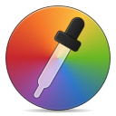

# Icons

Includes `svg` and `png` icons. The icons were made as `svg` and these are included for ease of modification. But the icons use mesh gradients for the fancy color background and this isn't part of the official `svg` spec yet and sometimes aren't rendered properly. So have to use the `png` exported icons for final deployment in the application.